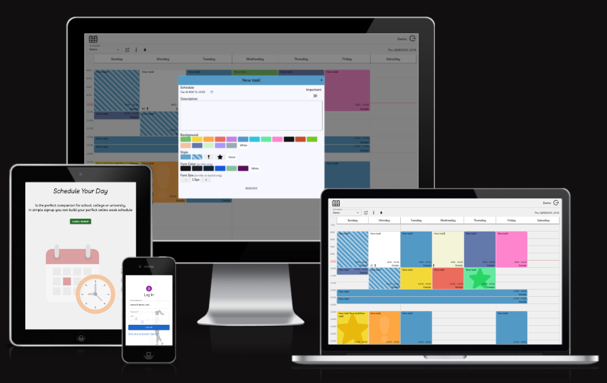

## Schedule Your Day
   
Is the perfect companion for school, college or university.
in simple signup you can build your perfect online week schedule
  
## Lessons Learned

I learned how to implement experiment advanced features such as PWA notification, also learnd to implement notification with firebase.
Working with complex database on MongoDB, user authentication.

## Demo

https://schedule-your-day.herokuapp.com/

## Screenshots

   <p align="left"><p/>

   

   <p align="left"><p/>
   
   
## Tech Stack

**Client:** React.js, Redux, SCSS

**Server:** Node.js, MongoDB

**Main Dependencies:** cors, mui, react-icons, PWA, notification

   <p align="left">
    <a href="" target="_blank" rel="noreferrer"> 
      </a>
    <a href="" target="_blank" rel="noreferrer"> 
      </a>
   <a href="https://sass-lang.com" target="_blank" rel="noreferrer"> 
      </a>
         <a href="https://reactjs.org/" target="_blank" rel="noreferrer"> 
      </a>
       <a href="https://redux.js.org" target="_blank" rel="noreferrer">
         
      </a>
      <a href="https://nodejs.org" target="_blank" rel="noreferrer">
         
      </a>
      <a href="https://www.mongodb.com/" target="_blank" rel="noreferrer"> 
      </a>
      <a href="https://firebase.google.com/" target="_blank" rel="noreferrer"> 
      </a>
           <a href="https://heroku.com" target="_blank" rel="noreferrer"> 
      </a>
   </p>
      
## Deployment

Clone the project - Frontend

```bash
  git clone https://github.com/EranAAA/schedule-your-day-forntend.git
  npm i --force
  npm start
```

Clone the project - Backend

```bash
  git clone https://github.com/EranAAA/schedule-your-day-backend.git
  npm i
  npm start
```
MongoDB: 
Create database: schedule_db
collection: user, schedule, notification

Notification:
Enabling via about://flags To experiment with the Notification Triggers API locally, 
without an origin trial token, enable the #enable-experimental-web-platform-features flag in about://flags.

