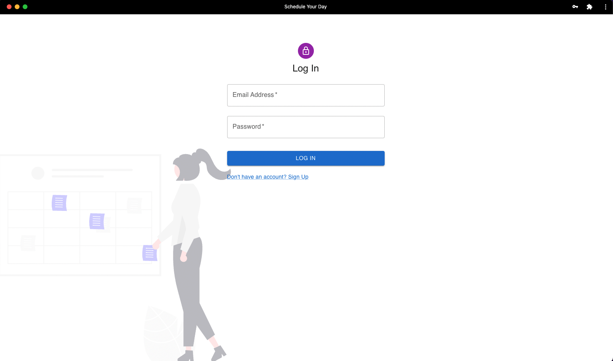

   <h1 align="left">Schedule Your Day</h1>
   

      Is the perfect companion for school, college or university.  
      in simple signup you can build your perfect online week schedule   
   
      **NEW** YOU CAN SCHEDULE YOUR NOTIFICATIONS
      (Enabling via about://flags To experiment with the Notification Triggers API locally, 
      without an origin trial token, enable the #enable-experimental-web-platform-features flag in about://flags.)
  

   <a target="_blank" rel="noreferrer" href="https://schedule-your-day.herokuapp.com/">ScheduleYourDay</a>  

   <h3 align="left">Languages and Tools:</h3>
   
(React.js last version (18), PWA+notification )

   

    
      
   
         
       
      
       
      
      
           
   

      <h3 align="left">install frontend</h3>
     
 npm i --force , npm start 

    
 If you want to use cloud messaging with firebase you have to create new firebase project, get the configs and pass to the relevant files 

    <h3 align="left">install backend</h3>
    
 npm i , npm start 

    
 MongoDB: you have to create database named: schedule_db and collection: user, schedule, notification 

      
  

   
Home page

   
  
   
Login/Signup page

   
    
   
Main app

   
    
   
Edit your task

   
    
   
Edit your notification

   
